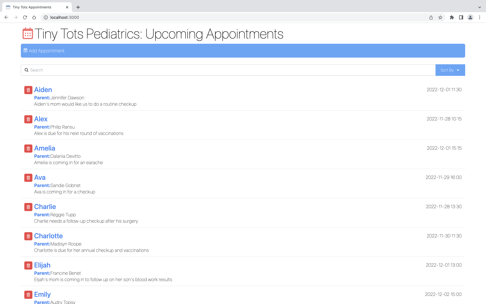
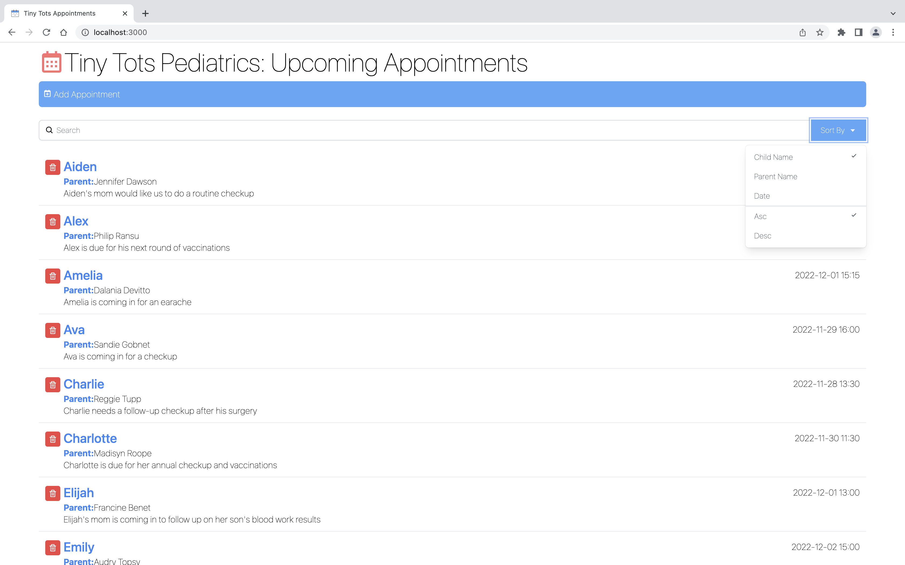
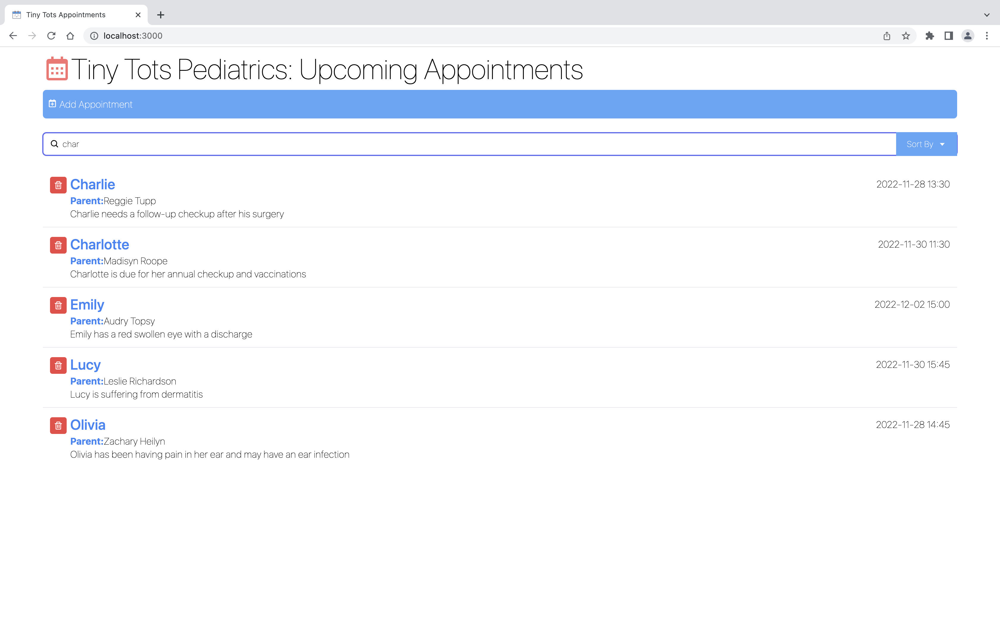
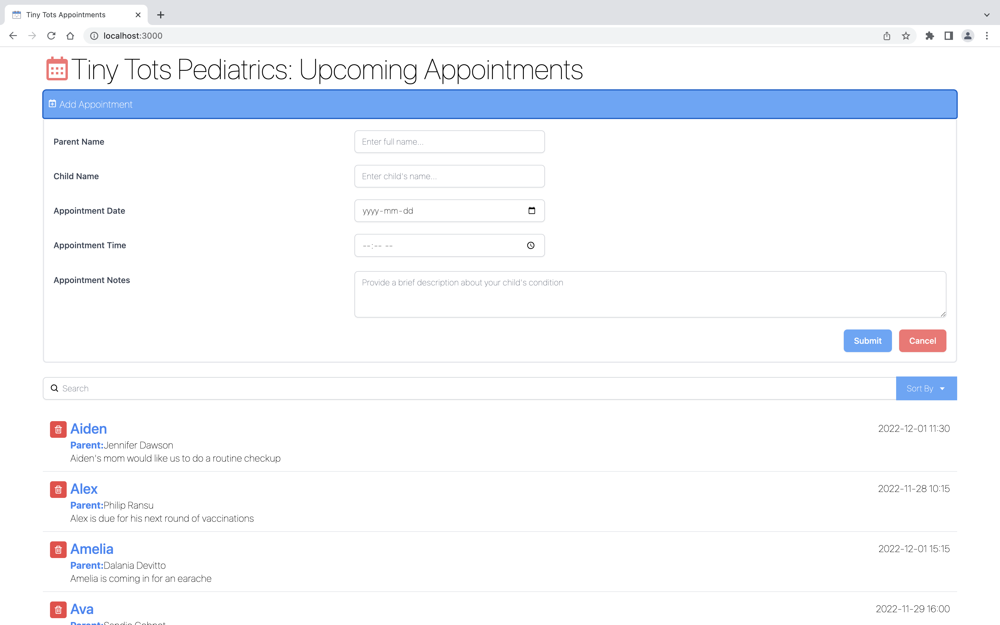

# Appointment App

> This is a frontend project built with React and Tailwind CSS that displays upcoming appointments at a fictional pediatric doctor's office.

## Features

- **Add New Appointments**: Users can easily add new appointments by providing the parent's name, child's name, appointment date and time, and any additional notes.

- **Search Appointments**: The app provides a search functionality that allows users to search for specific appointments based on parent's name, child's name, or appointment notes.

- **Sort Appointments**: Users can sort the appointment list in ascending or descending order, by date, child's name or parent's name.

- **Delete Appointments**: Appointments can be deleted from the list with a simple click of a button.

## Technologies Used

- React: A JavaScript library for building user interfaces.
- Tailwind CSS: A utility-first CSS framework for quickly styling the app.
- JavaScript: The programming language used for the app's logic and functionality.

## Screenshots

| Screenshot 1 | Screenshot 2 |
|--------------|--------------|
|  |  |

| Screenshot 3 | Screenshot 4 |
|--------------|--------------|
|  |  |

